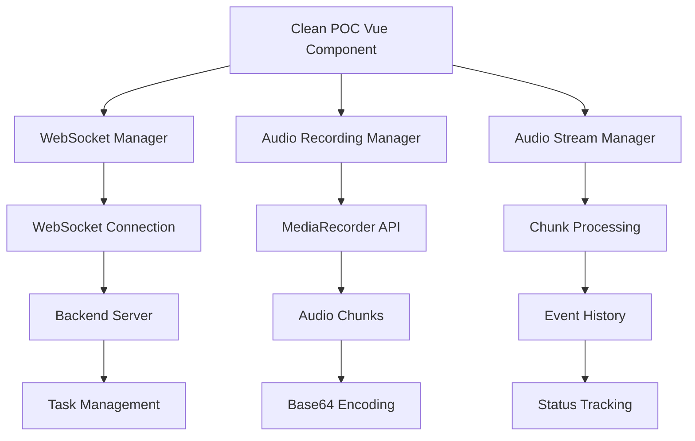
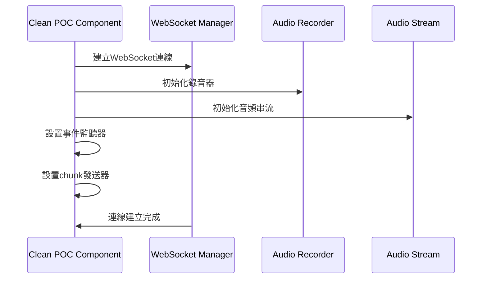
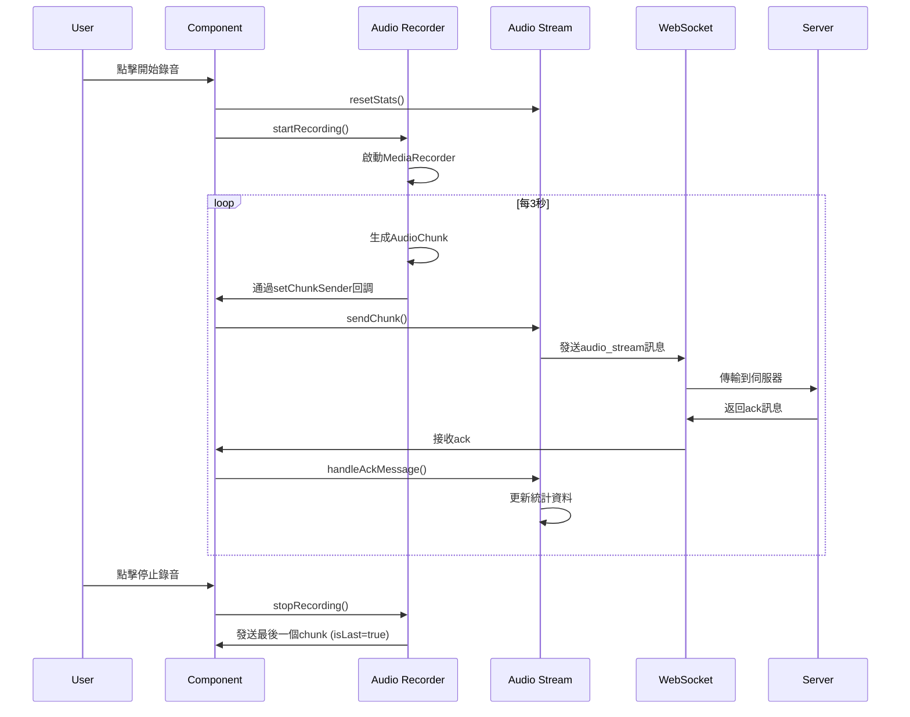
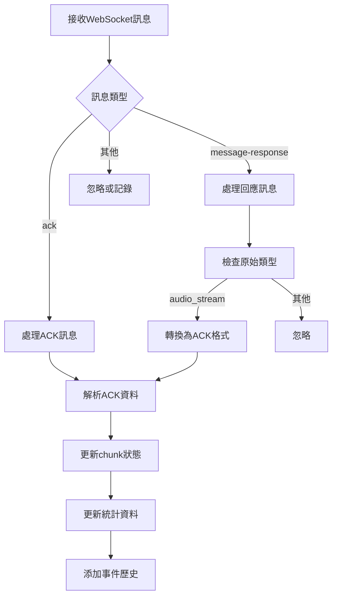

# Clean POC - 音頻錄製與傳輸系統

## 📋 系統概述

這是一個基於 Vue 3 + TypeScript 的即時音頻錄製與串流傳輸系統，整合了 WebSocket 通訊、音頻處理、斷線重連等功能。

## 🏗️ 系統架構



## 📊 核心資料格式

### 1. WebSocket 配置 (wsConfig)

```typescript
interface WebSocketConfig {
  url: string // WebSocket 伺服器地址
  reconnectAttempts: number // 重連嘗試次數
  reconnectInterval: number // 重連間隔 (ms)
  heartbeatInterval: number // 心跳間隔 (ms)
  backgroundReconnectEnabled: boolean // 背景重連開關
  minReconnectDelay: number // 最小重連延遲
  maxReconnectDelay: number // 最大重連延遲
  exponentialBackoff: boolean // 指數退避算法
}

// 實際配置
const wsConfig = {
  url: 'ws://localhost:8080/poc2',
  reconnectAttempts: 20,
  reconnectInterval: 2000,
  heartbeatInterval: 5000,
  backgroundReconnectEnabled: true,
  minReconnectDelay: 2000,
  maxReconnectDelay: 8000,
  exponentialBackoff: false,
}
```

### 2. 音頻塊 (AudioChunk) 格式

```typescript
interface AudioChunk {
  id: string // UUID 格式的唯一識別碼
  sequenceNumber: number // 順序編號（從0開始）
  audioData: string // Base64 編碼的音頻資料
  format: 'mp3' | 'wav' | 'webm' // 音頻格式
  duration: number // 音頻長度（秒）
  timestamp: number // 時間戳記
  isLast: boolean // 是否為最後一塊
  status: AudioChunkStatus // 狀態
  sentAt?: number // 發送時間
  acknowledgedAt?: number // 確認時間
  errorMessage?: string // 錯誤訊息
  metadata?: { // 可選的元資料
    sampleRate?: number // 採樣率
    channels?: number // 聲道數
    bitRate?: number // 位元率
  }
}

enum AudioChunkStatus {
  PENDING = 'pending', // 等待發送
  SENT = 'sent', // 已發送
  RECEIVED = 'received', // 已接收
  PROCESSED = 'processed', // 已處理
  ERROR = 'error' // 錯誤
}
```

### 3. WebSocket 訊息格式

#### 音頻串流訊息 (Client → Server)

```typescript
interface AudioStreamMessage {
  type: 'audio_stream'
  data: {
    chunkId: string // UUID 格式
    sequenceNumber: number // 順序編號
    audioData: string // Base64 音頻資料
    format: 'mp3' | 'wav' | 'webm'
    duration: number // 持續時間
    timestamp: number // 時間戳記
    isLast: boolean // 最後一塊標記
    metadata?: { // 音頻元資料
      sampleRate?: number
      channels?: number
      bitRate?: number
    }
  }
  taskId?: string // 任務ID（可選）
}
```

#### 確認訊息 (Server → Client)

```typescript
interface AckMessage {
  type: 'ack'
  data: {
    chunkId: string // 對應的塊ID
    sequenceNumber: number // 順序編號
    status: 'received' | 'processed' | 'error'
    timestamp: number // 時間戳記
    errorMessage?: string // 錯誤訊息（status為error時）
    processingTime?: number // 處理時間（毫秒）
    integrityCheck?: { // 完整性檢查
      isComplete: boolean
      expectedSize?: number
      actualSize?: number
      checksum?: string
      corruptionDetails?: string
    }
  }
  taskId?: string
}
```

#### 訊息回應 (Server → Client)

```typescript
interface MessageResponse {
  type: 'message-response'
  data: {
    originalType: string // 原始訊息類型
    data: any // 回應資料
    timestamp: number // 時間戳記
  }
}
```

### 4. 錄音統計資料

```typescript
interface RecordingStats {
  sessionId: string // 會話ID
  totalDuration: number // 總錄音時長（秒）
  chunksGenerated: number // 已生成的塊數量
  disconnectionCount: number // 斷線次數
}
```

### 5. 音頻串流統計資料

```typescript
interface AudioStreamStats {
  totalChunks: number // 總塊數
  generatedChunks: number // 已生成塊數
  sentChunks: number // 已發送塊數
  acknowledgedChunks: number // 已確認塊數
  pendingChunks: number // 待處理塊數
  errorChunks: number // 錯誤塊數
  legacyStats: { // 舊版統計
    acknowledgedChunks: number
    sentChunks: number
    errorChunks: number
  }
}
```

### 6. 事件歷史格式

```typescript
interface EventHistory {
  id: string // 事件ID
  eventType: 'outgoing' | 'incoming' // 事件類型
  action: string // 動作類型
  chunkId: string // 相關塊ID
  sequenceNumber: number // 序列號
  status: string // 狀態
  timestamp: number // 時間戳記
}

// 動作類型包括：
// - 'send': 發送音頻塊
// - 'receive': 接收確認
// - 'process': 處理中
// - 'queued': 已佇列
// - 'connection_lost': 連線中斷
// - 'connection_restored': 連線恢復
// - 'error': 錯誤
```

## 🔄 系統流程

### 1. 初始化流程



### 2. 錄音與傳輸流程



### 3. 斷線重連流程

```mermaid
sequenceDiagram
    participant C as Component
    participant WS as WebSocket
    participant AS as Audio Stream
    participant HB as Heartbeat
    participant S as Server

    Note over WS,S: 正常連線狀態
    WS-X-S: 網路斷線

    HB->>HB: 心跳超時檢測
    HB->>WS: 觸發重連機制
    AS->>AS: 暫存pending chunks

    loop 重連嘗試
        WS->>WS: 嘗試重新連線
        WS->>S: 建立連線
    end

    WS->>C: 連線恢復通知
    C->>AS: onConnectionRestored()
    AS->>AS: processPendingChunks()
    AS->>S: 發送暫存的chunks
    S->>AS: 確認接收
```

### 4. 訊息處理流程



## 🎛️ 使用者介面狀態

### 1. 連線狀態顯示

```typescript
// 連線狀態
type ConnectionState = 'connecting' | 'connected' | 'disconnected' | 'error'

// UI 對應
const connectionStatusMap = {
  connected: { text: '已連接', icon: '🟢', class: 'bg-green-50' },
  connecting: { text: '連接中', icon: '🟡', class: 'bg-yellow-50' },
  disconnected: { text: '未連接', icon: '🔴', class: 'bg-red-50' }
}
```

### 2. 錄音狀態顯示

```typescript
enum RecordingState {
  IDLE = 'idle',
  RECORDING = 'recording',
  PAUSED = 'paused',
  STOPPED = 'stopped'
}

// UI 對應
const recordingStatusMap = {
  RECORDING: { text: '錄製中', class: 'bg-red-50', indicator: 'bg-red-400 animate-pulse' },
  PAUSED: { text: '已暫停', class: 'bg-yellow-50', indicator: 'bg-yellow-400' },
  STOPPED: { text: '已停止', class: 'bg-gray-50', indicator: 'bg-gray-300' },
  IDLE: { text: '閒置', class: 'bg-gray-50', indicator: 'bg-gray-300' }
}
```

### 3. 按鈕啟用邏輯

```typescript
// 按鈕狀態控制
const buttonStates = {
  connect: computed(() => !isConnected.value && !isConnecting.value),
  disconnect: computed(() => isConnected.value),
  startRecording: computed(() => canStart.value && isConnected.value),
  pauseRecording: computed(() => recordingState.value === RecordingState.RECORDING),
  resumeRecording: computed(() => canResume.value),
  stopRecording: computed(() =>
    recordingState.value === RecordingState.RECORDING
    || recordingState.value === RecordingState.PAUSED
  ),
  download: computed(() => audioStats.value.totalChunks > 0)
}
```

## 🎨 事件歷史視覺化

### 事件類型與顏色對應

```typescript
const eventBackgroundMap = {
  send: 'bg-blue-50 border-l-4 border-blue-200', // 藍色 - 發送
  receive: 'bg-green-50 border-l-4 border-green-200', // 綠色 - 接收
  process: 'bg-purple-50 border-l-4 border-purple-200', // 紫色 - 處理
  queued: 'bg-yellow-50 border-l-4 border-yellow-200', // 黃色 - 佇列
  connection_lost: 'bg-red-50 border-l-4 border-red-300', // 紅色 - 斷線
  connection_restored: 'bg-emerald-50 border-l-4 border-emerald-300', // 翠綠 - 恢復
  error: 'bg-red-100 border-l-4 border-red-400', // 深紅 - 錯誤
  default: 'bg-gray-50 border-l-4 border-gray-200' // 灰色 - 其他
}

const statusColorMap = {
  sent: 'text-blue-600',
  acknowledged: 'text-green-600',
  error: 'text-red-600',
  default: 'text-gray-600'
}
```

## 🔧 關鍵功能實作

### 1. 音頻塊發送機制

```typescript
// setChunkSender 回調函數
setChunkSender((chunk: AudioChunk) => {
  // 1. 記錄發送動作
  console.log(`🔗 Recording system sending chunk ${chunk.sequenceNumber}`)

  // 2. 無論連線狀態都要處理（重要！）
  try {
    const success = sendChunk(chunk, send, currentTaskId.value)

    // 3. 根據連線狀態記錄不同訊息
    if (isConnected.value) {
      // 連線正常：立即發送
      logSendResult(success, chunk)
    }
    else {
      // 斷線狀態：暫存等待重連
      logPendingChunk(chunk)
    }
  }
  catch (error) {
    logSendError(error, chunk)
  }
})
```

### 2. WebSocket 訊息處理

```typescript
// 監聽 WebSocket 訊息
watch(lastMessage, (newMessage) => {
  if (!newMessage)
    return

  // ACK 訊息處理
  if (newMessage.type === 'ack') {
    const ackMessage = {
      type: 'ack' as const,
      data: {
        chunkId: newMessage.data.chunkId,
        sequenceNumber: newMessage.data.sequenceNumber,
        status: newMessage.data.status,
        timestamp: newMessage.data.timestamp,
        errorMessage: newMessage.data.errorMessage,
      }
    }
    handleAckMessage(ackMessage)
  }

  // 訊息回應處理
  else if (newMessage.type === 'message-response') {
    const responsePayload = newMessage.data.data

    // 轉換為 ACK 格式
    if (responsePayload?.originalType === 'audio_stream') {
      const ackMessage = {
        type: 'ack' as const,
        data: {
          chunkId: responsePayload.data.chunkId,
          sequenceNumber: responsePayload.data.sequenceNumber,
          status: 'received' as const,
          timestamp: newMessage.data.timestamp,
        }
      }
      handleAckMessage(ackMessage)
    }
  }
})
```

### 3. 重連後的資料恢復

```typescript
// 連線恢復回調
onWsConnectionEstablished(async () => {
  // 1. 通知音頻串流系統
  onConnectionRestored()

  // 2. 處理暫存的 chunks
  try {
    await processPendingChunks(send, currentTaskId.value)
    console.log('✅ 重連後待發送 chunks 處理完成')
  }
  catch (error) {
    console.error('❌ 處理 pending chunks 失敗:', error)
  }
})
```

## 📈 監控與除錯

### 重要日誌點

1. **連線狀態變化**
   - 🔗 WebSocket 連線建立
   - 🔌 WebSocket 連線關閉
   - 🔄 自動重連觸發

2. **音頻處理**
   - 🎙️ 開始/停止錄音
   - 📦 Chunk 生成與發送
   - ✅ Chunk 確認接收

3. **錯誤處理**
   - ❌ 發送失敗
   - ⚠️ 連線異常
   - 💔 心跳超時

### 統計資料監控

- **錄音統計**: 時長、塊數、斷線次數
- **傳輸統計**: 總數、發送數、確認數、錯誤數、待處理數
- **佇列狀態**: 當前佇列長度
- **連線狀態**: 重連次數、任務ID

## 🚀 部署與使用

### 環境需求

- Node.js 16+
- 支援 WebSocket 的瀏覽器
- 麥克風權限
- WebSocket 伺服器 (localhost:8080/poc2)

### 啟動步驟

1. 啟動 WebSocket 伺服器
2. 開啟 Clean POC 頁面
3. 點擊「連接」建立 WebSocket 連線
4. 點擊「開始錄音」開始錄製
5. 監控統計資料與事件歷史

### 測試建議

- 測試網路斷線恢復
- 測試長時間錄音
- 測試暫停/恢復功能
- 監控記憶體使用量
- 檢查音頻檔案完整性
