# Clean POC 系統功能分類文檔

## 📋 系統概述

基於 `clean-poc.vue` 的音頻錄製與串流傳輸系統，按功能模組分類說明對應的資料格式和流程。

---

## 🔌 1. WebSocket 連線管理功能

### 功能描述

負責建立、維護和監控 WebSocket 連線，包含心跳機制和自動重連。

### 📊 相關資料格式

#### 1.1 WebSocket 配置

```typescript
interface WebSocketConfig {
  url: string // WebSocket 伺服器地址
  reconnectAttempts: number // 重連嘗試次數 (預設: 20)
  reconnectInterval: number // 重連間隔 ms (預設: 2000)
  heartbeatInterval: number // 心跳間隔 ms (預設: 5000)
  backgroundReconnectEnabled: boolean // 背景重連開關 (預設: true)
  minReconnectDelay: number // 最小重連延遲 ms (預設: 2000)
  maxReconnectDelay: number // 最大重連延遲 ms (預設: 8000)
  exponentialBackoff: boolean // 指數退避算法 (預設: false)
}

// 實際配置範例
const wsConfig = {
  url: 'ws://localhost:8080/poc2',
  reconnectAttempts: 20,
  reconnectInterval: 2000,
  heartbeatInterval: 5000,
  backgroundReconnectEnabled: true,
  minReconnectDelay: 2000,
  maxReconnectDelay: 8000,
  exponentialBackoff: false,
}
```

#### 1.2 連線狀態資料

```typescript
type WebSocketConnectionState = 'connecting' | 'connected' | 'disconnected' | 'error'

interface ConnectionStatus {
  state: WebSocketConnectionState
  taskId: string | null // 當前任務ID
  reconnectCount: number // 重連次數
  lastError: string | null // 最後錯誤訊息
  isReconnection: boolean // 是否為重連狀態
}
```

#### 1.3 心跳訊息格式

```typescript
// 心跳 Ping (Client → Server)
interface HeartbeatPing {
  type: 'frontend-heartbeat-ping'
  timestamp: number
  clientId: string
}

// 心跳 Pong (Server → Client)
interface HeartbeatPong {
  type: 'frontend-heartbeat-pong' | 'pong'
  timestamp: number
  serverId?: string
}
```

### 🔄 功能流程

#### 1.4 連線建立流程

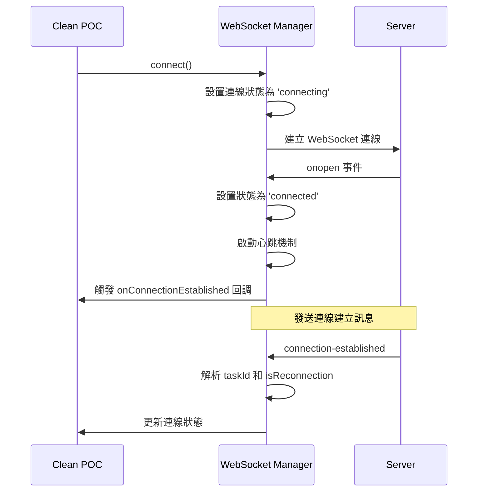
```mermaid
sequenceDiagram
    participant C as Clean POC
    participant WS as WebSocket Manager
    participant S as Server

    C->>WS: connect()
    WS->>WS: 設置連線狀態為 'connecting'
    WS->>S: 建立 WebSocket 連線
    S->>WS: onopen 事件
    WS->>WS: 設置狀態為 'connected'
    WS->>WS: 啟動心跳機制
    WS->>C: 觸發 onConnectionEstablished 回調

    Note over S,WS: 發送連線建立訊息
    S->>WS: connection-established
    WS->>WS: 解析 taskId 和 isReconnection
    WS->>C: 更新連線狀態
```

#### 1.5 心跳監控流程

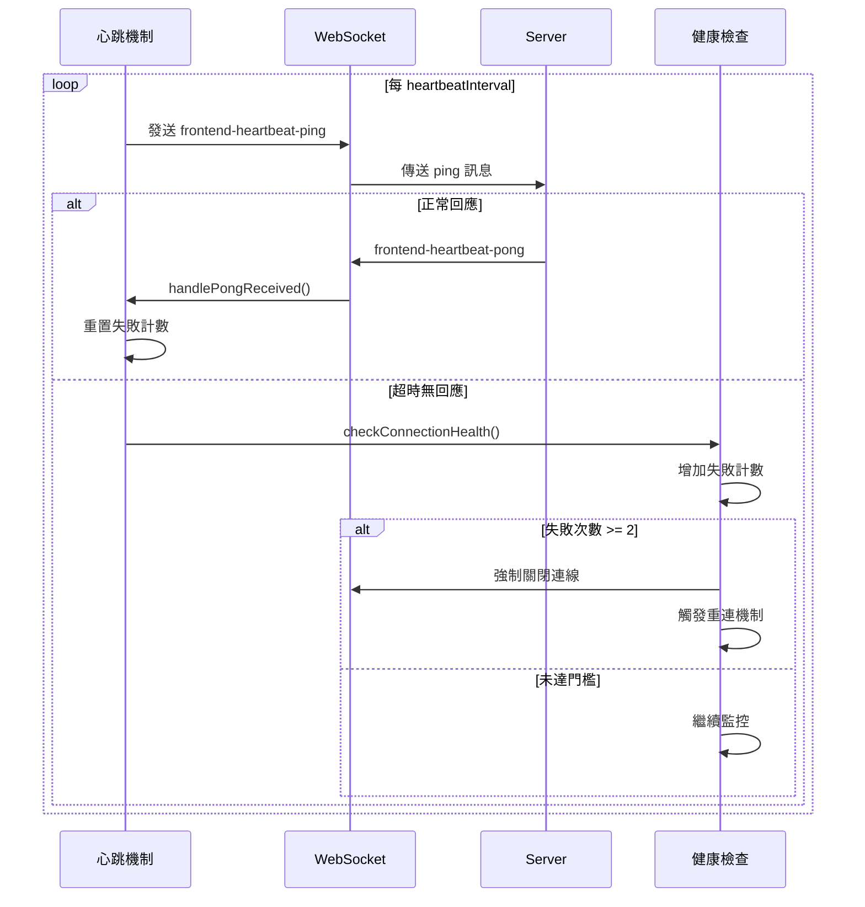
```mermaid
sequenceDiagram
    participant HB as 心跳機制
    participant WS as WebSocket
    participant S as Server
    participant CHK as 健康檢查

    loop 每 heartbeatInterval
        HB->>WS: 發送 frontend-heartbeat-ping
        WS->>S: 傳送 ping 訊息

        alt 正常回應
            S->>WS: frontend-heartbeat-pong
            WS->>HB: handlePongReceived()
            HB->>HB: 重置失敗計數
        else 超時無回應
            HB->>CHK: checkConnectionHealth()
            CHK->>CHK: 增加失敗計數

            alt 失敗次數 >= 2
                CHK->>WS: 強制關閉連線
                CHK->>CHK: 觸發重連機制
            else 未達門檻
                CHK->>CHK: 繼續監控
            end
        end
    end
```

#### 1.6 斷線重連流程

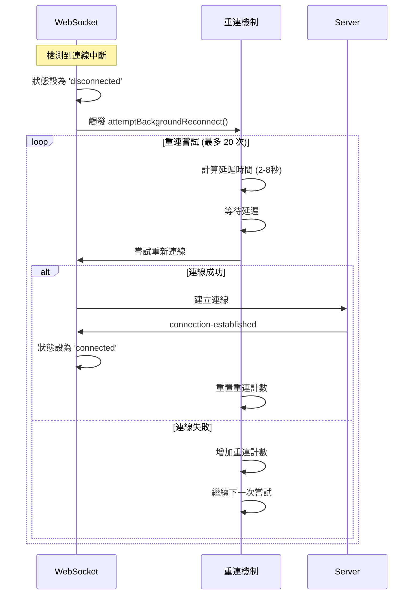
```mermaid
sequenceDiagram
    participant WS as WebSocket
    participant RC as 重連機制
    participant S as Server

    Note over WS: 檢測到連線中斷
    WS->>WS: 狀態設為 'disconnected'
    WS->>RC: 觸發 attemptBackgroundReconnect()

    loop 重連嘗試 (最多 20 次)
        RC->>RC: 計算延遲時間 (2-8秒)
        RC->>RC: 等待延遲
        RC->>WS: 嘗試重新連線

        alt 連線成功
            WS->>S: 建立連線
            S->>WS: connection-established
            WS->>WS: 狀態設為 'connected'
            RC->>RC: 重置重連計數
        else 連線失敗
            RC->>RC: 增加重連計數
            RC->>RC: 繼續下一次嘗試
        end
    end
```

---

## 🎙️ 2. 音頻錄製功能

### 功能描述

控制麥克風錄音、生成音頻塊 (AudioChunk)，支援開始、暫停、恢復、停止錄音。

### 📊 相關資料格式

#### 2.1 錄音狀態

```typescript
enum RecordingState {
  IDLE = 'idle', // 閒置狀態
  RECORDING = 'recording', // 錄製中
  PAUSED = 'paused', // 已暫停
  STOPPED = 'stopped' // 已停止
}
```

#### 2.2 錄音統計資料

```typescript
interface RecordingStats {
  sessionId: string // 會話 ID (UUID)
  totalDuration: number // 總錄音時長（秒）
  chunksGenerated: number // 已生成的音頻塊數量
  disconnectionCount: number // 錄音期間的斷線次數
  pausedDuration: number // 暫停累計時長（秒）
  lastResumeTimestamp: number // 上次恢復錄音時間戳
}
```

#### 2.3 音頻塊 (AudioChunk) 格式

```typescript
interface AudioChunk {
  id: string // UUID 格式的唯一識別碼
  sequenceNumber: number // 順序編號（從 0 開始遞增）
  audioData: string // Base64 編碼的音頻資料
  format: 'mp3' | 'wav' | 'webm' // 音頻格式
  duration: number // 音頻長度（秒，固定 3 秒）
  timestamp: number // 生成時間戳記
  isLast: boolean // 是否為最後一個音頻塊
  status: AudioChunkStatus // 處理狀態
  sentAt?: number // 發送時間戳（可選）
  acknowledgedAt?: number // 確認時間戳（可選）
  errorMessage?: string // 錯誤訊息（可選）
  metadata?: { // 音頻元資料（可選）
    sampleRate?: number // 採樣率 (Hz)
    channels?: number // 聲道數 (1=單聲道, 2=立體聲)
    bitRate?: number // 位元率 (bps)
  }
}

enum AudioChunkStatus {
  PENDING = 'pending', // 等待發送
  SENT = 'sent', // 已發送
  RECEIVED = 'received', // 伺服器已接收
  PROCESSED = 'processed', // 伺服器已處理
  ERROR = 'error' // 處理錯誤
}
```

### 🔄 功能流程

#### 2.4 開始錄音流程

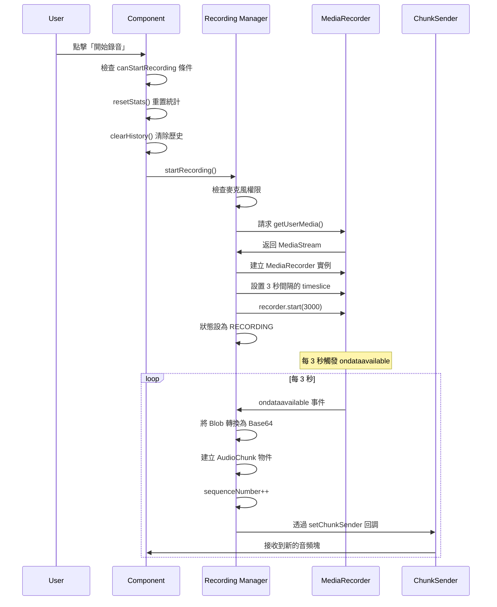
```mermaid
sequenceDiagram
    participant U as User
    participant C as Component
    participant R as Recording Manager
    participant M as MediaRecorder
    participant CS as ChunkSender

    U->>C: 點擊「開始錄音」
    C->>C: 檢查 canStartRecording 條件
    C->>C: resetStats() 重置統計
    C->>C: clearHistory() 清除歷史
    C->>R: startRecording()

    R->>R: 檢查麥克風權限
    R->>M: 請求 getUserMedia()
    M->>R: 返回 MediaStream
    R->>M: 建立 MediaRecorder 實例
    R->>M: 設置 3 秒間隔的 timeslice
    R->>M: recorder.start(3000)
    R->>R: 狀態設為 RECORDING

    Note over M: 每 3 秒觸發 ondataavailable

    loop 每 3 秒
        M->>R: ondataavailable 事件
        R->>R: 將 Blob 轉換為 Base64
        R->>R: 建立 AudioChunk 物件
        R->>R: sequenceNumber++
        R->>CS: 透過 setChunkSender 回調
        CS->>C: 接收到新的音頻塊
    end
```

#### 2.5 暫停/恢復錄音流程

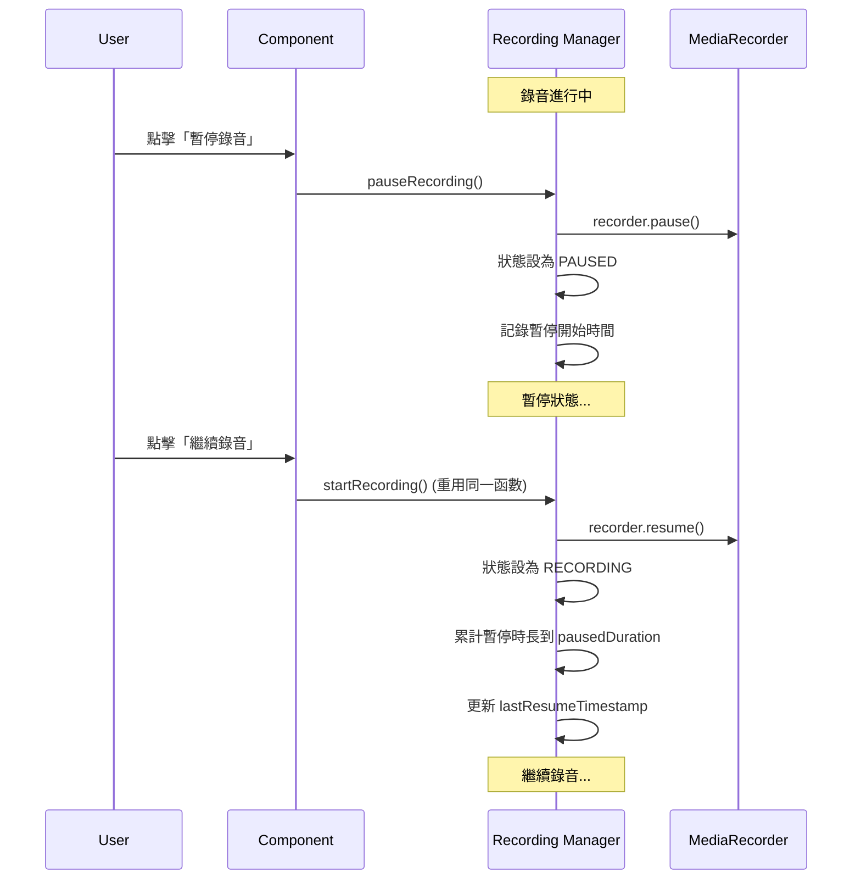
```mermaid
sequenceDiagram
    participant U as User
    participant C as Component
    participant R as Recording Manager
    participant M as MediaRecorder

    Note over R: 錄音進行中

    U->>C: 點擊「暫停錄音」
    C->>R: pauseRecording()
    R->>M: recorder.pause()
    R->>R: 狀態設為 PAUSED
    R->>R: 記錄暫停開始時間

    Note over R: 暫停狀態...

    U->>C: 點擊「繼續錄音」
    C->>R: startRecording() (重用同一函數)
    R->>M: recorder.resume()
    R->>R: 狀態設為 RECORDING
    R->>R: 累計暫停時長到 pausedDuration
    R->>R: 更新 lastResumeTimestamp

    Note over R: 繼續錄音...
```

#### 2.6 停止錄音流程

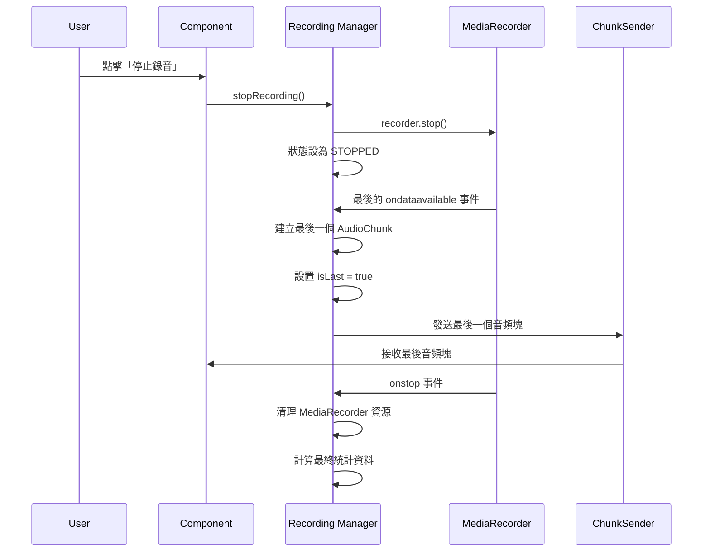
```mermaid
sequenceDiagram
    participant U as User
    participant C as Component
    participant R as Recording Manager
    participant M as MediaRecorder
    participant CS as ChunkSender

    U->>C: 點擊「停止錄音」
    C->>R: stopRecording()
    R->>M: recorder.stop()
    R->>R: 狀態設為 STOPPED

    M->>R: 最後的 ondataavailable 事件
    R->>R: 建立最後一個 AudioChunk
    R->>R: 設置 isLast = true
    R->>CS: 發送最後一個音頻塊
    CS->>C: 接收最後音頻塊

    M->>R: onstop 事件
    R->>R: 清理 MediaRecorder 資源
    R->>R: 計算最終統計資料
```

---

## 🌊 3. 音頻串流傳輸功能

### 功能描述

負責將音頻塊透過 WebSocket 傳送到伺服器，處理確認訊息，管理傳輸佇列和重傳機制。

### 📊 相關資料格式

#### 3.1 音頻串流訊息 (Client → Server)

```typescript
interface AudioStreamMessage {
  type: 'audio_stream'
  data: {
    chunkId: string // 音頻塊 UUID
    sequenceNumber: number // 順序編號
    audioData: string // Base64 編碼的音頻資料
    format: 'mp3' | 'wav' | 'webm' // 音頻格式
    duration: number // 持續時間（秒）
    timestamp: number // 時間戳記
    isLast: boolean // 是否為最後一塊
    metadata?: { // 音頻元資料（可選）
      sampleRate?: number
      channels?: number
      bitRate?: number
    }
  }
  taskId?: string // 任務ID（可選）
}
```

#### 3.2 確認訊息 (Server → Client)

```typescript
interface AckMessage {
  type: 'ack'
  data: {
    chunkId: string // 對應的音頻塊ID
    sequenceNumber: number // 順序編號
    status: 'received' | 'processed' | 'error' // 處理狀態
    timestamp: number // 伺服器時間戳記
    errorMessage?: string // 錯誤訊息（當 status='error' 時）
    processingTime?: number // 處理時間（毫秒）
    integrityCheck?: { // 完整性檢查結果（可選）
      isComplete: boolean
      expectedSize?: number
      actualSize?: number
      checksum?: string
      corruptionDetails?: string
    }
  }
  taskId?: string
}
```

#### 3.3 訊息回應格式 (Server → Client)

```typescript
interface MessageResponse {
  type: 'message-response'
  data: {
    originalType: string // 原始訊息類型 ('audio_stream')
    data: { // 回應資料
      chunkId: string
      sequenceNumber: number
      status?: string
    }
    timestamp: number // 時間戳記
  }
}
```

#### 3.4 音頻串流統計

```typescript
interface AudioStreamStats {
  totalChunks: number // 總音頻塊數
  generatedChunks: number // 已生成音頻塊數
  sentChunks: number // 已發送音頻塊數
  acknowledgedChunks: number // 已確認音頻塊數
  pendingChunks: number // 待處理音頻塊數
  errorChunks: number // 錯誤音頻塊數
  legacyStats: { // 舊版統計（相容性）
    acknowledgedChunks: number
    sentChunks: number
    errorChunks: number
  }
}
```

#### 3.5 串流狀態資料

```typescript
interface AudioStreamState {
  sendQueue: AudioChunk[] // 發送佇列
  pendingChunks: Map<string, AudioChunk> // 待確認的音頻塊
  acknowledgedChunks: Set<string> // 已確認的音頻塊ID集合
  errorChunks: Set<string> // 錯誤的音頻塊ID集合
}
```

### 🔄 功能流程

#### 3.6 音頻塊發送流程

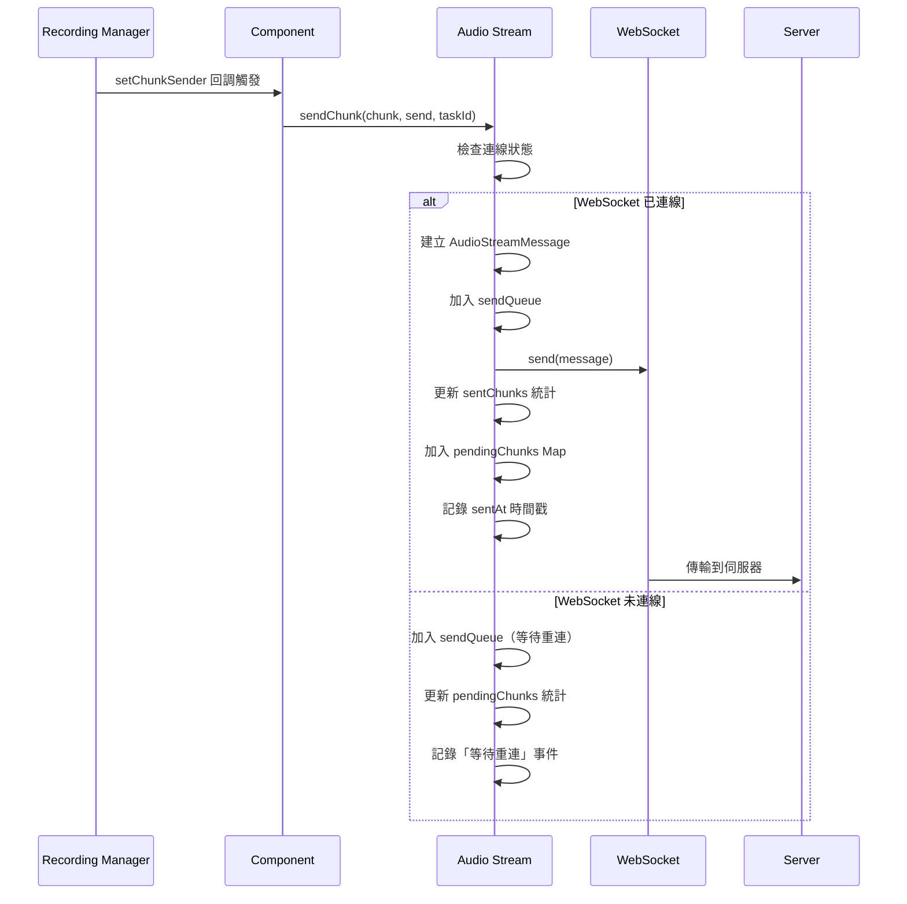
```mermaid
sequenceDiagram
    participant R as Recording Manager
    participant C as Component
    participant AS as Audio Stream
    participant WS as WebSocket
    participant S as Server

    R->>C: setChunkSender 回調觸發
    C->>AS: sendChunk(chunk, send, taskId)

    AS->>AS: 檢查連線狀態

    alt WebSocket 已連線
        AS->>AS: 建立 AudioStreamMessage
        AS->>AS: 加入 sendQueue
        AS->>WS: send(message)
        AS->>AS: 更新 sentChunks 統計
        AS->>AS: 加入 pendingChunks Map
        AS->>AS: 記錄 sentAt 時間戳

        WS->>S: 傳輸到伺服器

    else WebSocket 未連線
        AS->>AS: 加入 sendQueue（等待重連）
        AS->>AS: 更新 pendingChunks 統計
        AS->>AS: 記錄「等待重連」事件
    end
```

#### 3.7 確認訊息處理流程

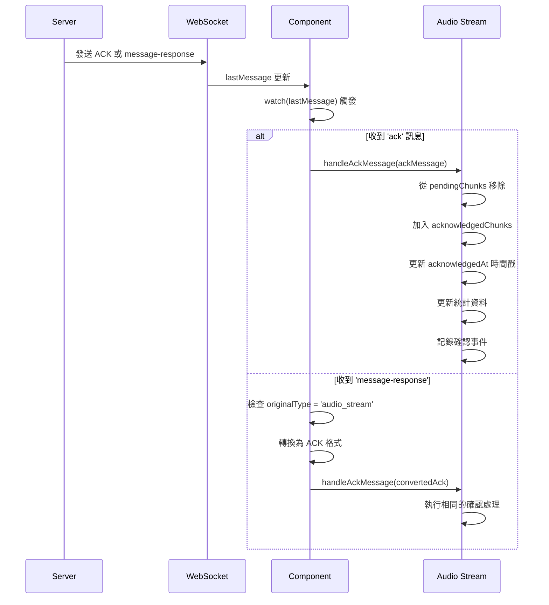
```mermaid
sequenceDiagram
    participant S as Server
    participant WS as WebSocket
    participant C as Component
    participant AS as Audio Stream

    S->>WS: 發送 ACK 或 message-response
    WS->>C: lastMessage 更新

    C->>C: watch(lastMessage) 觸發

    alt 收到 'ack' 訊息
        C->>AS: handleAckMessage(ackMessage)
        AS->>AS: 從 pendingChunks 移除
        AS->>AS: 加入 acknowledgedChunks
        AS->>AS: 更新 acknowledgedAt 時間戳
        AS->>AS: 更新統計資料
        AS->>AS: 記錄確認事件

    else 收到 'message-response'
        C->>C: 檢查 originalType = 'audio_stream'
        C->>C: 轉換為 ACK 格式
        C->>AS: handleAckMessage(convertedAck)
        AS->>AS: 執行相同的確認處理
    end
```

#### 3.8 重連後資料恢復流程

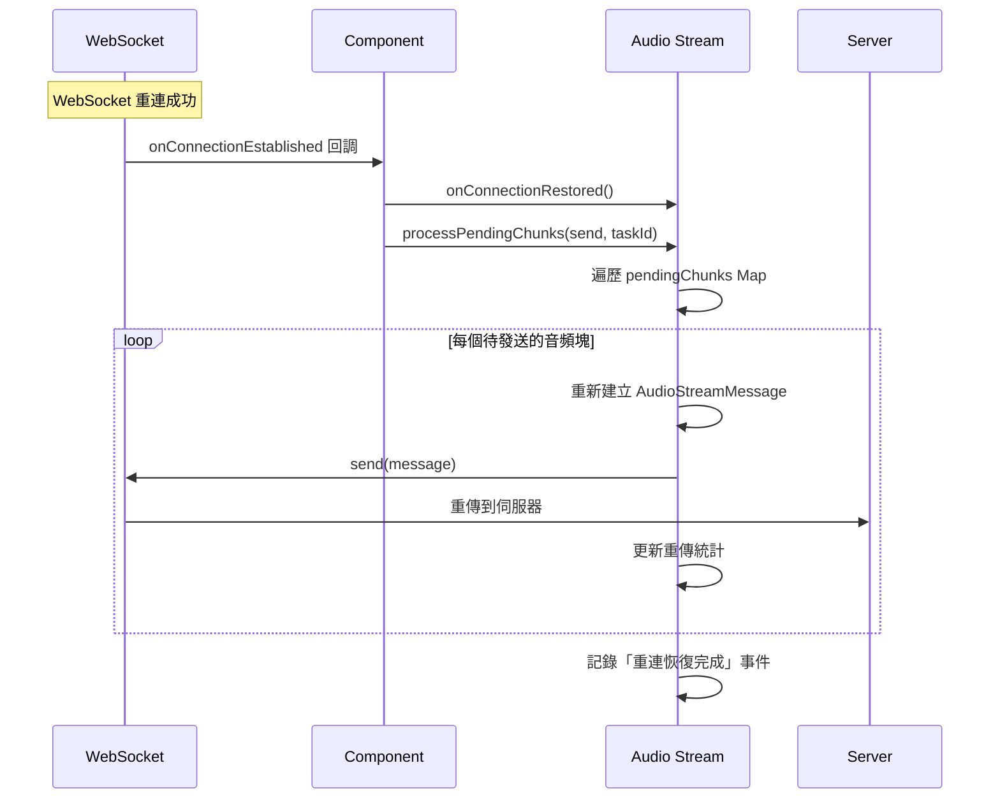
```mermaid
sequenceDiagram
    participant WS as WebSocket
    participant C as Component
    participant AS as Audio Stream
    participant S as Server

    Note over WS: WebSocket 重連成功
    WS->>C: onConnectionEstablished 回調
    C->>AS: onConnectionRestored()
    C->>AS: processPendingChunks(send, taskId)

    AS->>AS: 遍歷 pendingChunks Map

    loop 每個待發送的音頻塊
        AS->>AS: 重新建立 AudioStreamMessage
        AS->>WS: send(message)
        WS->>S: 重傳到伺服器
        AS->>AS: 更新重傳統計
    end

    AS->>AS: 記錄「重連恢復完成」事件
```

---

## 📊 4. 事件歷史追蹤功能

### 功能描述

記錄和顯示所有音頻處理相關的事件，提供系統操作的可視化追蹤。

### 📊 相關資料格式

#### 4.1 事件歷史記錄

```typescript
interface EventHistory {
  id: string // 事件唯一ID (UUID)
  eventType: 'outgoing' | 'incoming' // 事件方向
  action: string // 事件動作類型
  chunkId: string // 相關的音頻塊ID
  sequenceNumber: number // 音頻塊序列號
  status: string // 事件狀態
  timestamp: number // 事件發生時間戳
  details?: any // 額外詳細資訊
}
```

#### 4.2 事件動作類型

```typescript
type EventAction
  = | 'send' // 發送音頻塊
    | 'receive' // 接收確認
    | 'process' // 處理中
    | 'queued' // 加入佇列
    | 'connection_lost' // 連線中斷
    | 'connection_restored' // 連線恢復
    | 'error' // 錯誤事件
    | 'retry' // 重試發送
    | 'timeout' // 超時事件
```

#### 4.3 分類事件歷史

```typescript
interface CategorizedEventHistory {
  outgoing: EventHistory[] // 發出的事件 (如：發送音頻塊)
  incoming: EventHistory[] // 接收的事件 (如：收到確認)
}
```

### 🔄 功能流程

#### 4.4 事件記錄流程

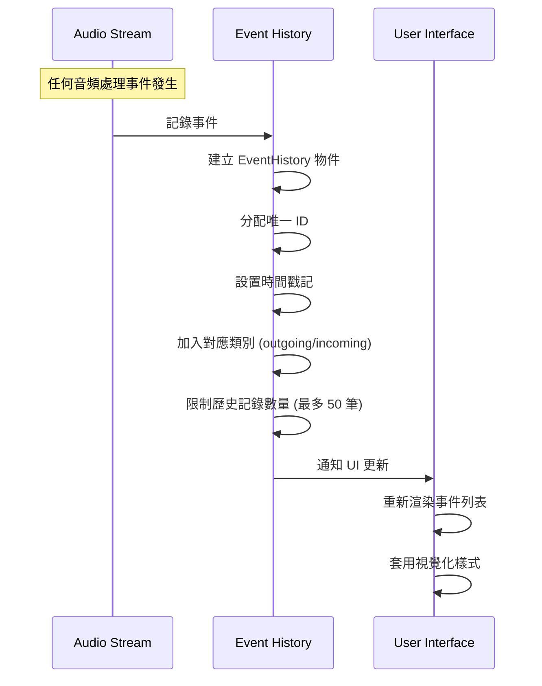
```mermaid
sequenceDiagram
    participant AS as Audio Stream
    participant EH as Event History
    participant UI as User Interface

    Note over AS: 任何音頻處理事件發生

    AS->>EH: 記錄事件
    EH->>EH: 建立 EventHistory 物件
    EH->>EH: 分配唯一 ID
    EH->>EH: 設置時間戳記
    EH->>EH: 加入對應類別 (outgoing/incoming)
    EH->>EH: 限制歷史記錄數量 (最多 50 筆)

    EH->>UI: 通知 UI 更新
    UI->>UI: 重新渲染事件列表
    UI->>UI: 套用視覺化樣式
```

#### 4.5 事件分類與顯示流程

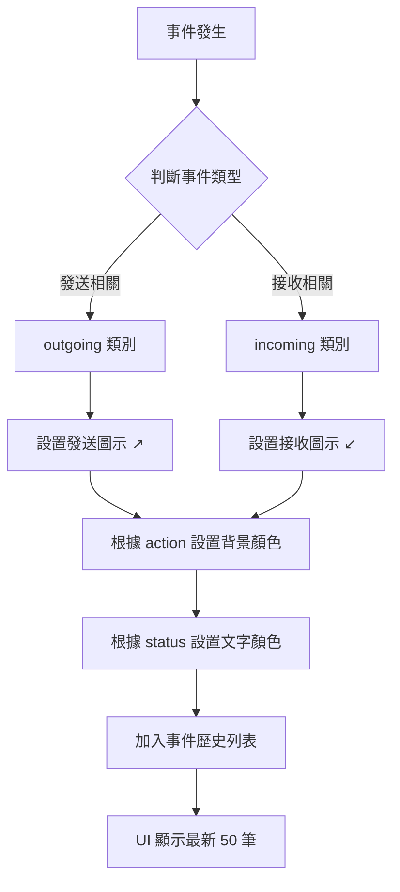
```mermaid
graph TD
    A[事件發生] --> B{判斷事件類型}

    B -->|發送相關| C[outgoing 類別]
    B -->|接收相關| D[incoming 類別]

    C --> E[設置發送圖示 ↗️]
    D --> F[設置接收圖示 ↙️]

    E --> G[根據 action 設置背景顏色]
    F --> G

    G --> H[根據 status 設置文字顏色]
    H --> I[加入事件歷史列表]
    I --> J[UI 顯示最新 50 筆]
```

---

## 🎛️ 5. 使用者介面狀態管理功能

### 功能描述

管理所有 UI 元件的狀態、按鈕啟用邏輯、視覺化指示器和統計資料顯示。

### 📊 相關資料格式

#### 5.1 連線狀態 UI 對應

```typescript
interface ConnectionUIState {
  text: string // 顯示文字
  icon: string // 狀態圖示
  class: string // CSS 樣式類別
}

const connectionStatusMap: Record<WebSocketConnectionState, ConnectionUIState> = {
  connected: {
    text: '已連接',
    icon: '🟢',
    class: 'bg-green-50 border border-green-200'
  },
  connecting: {
    text: '連接中',
    icon: '🟡',
    class: 'bg-yellow-50 border border-yellow-200'
  },
  disconnected: {
    text: '未連接',
    icon: '🔴',
    class: 'bg-red-50 border border-red-200'
  },
  error: {
    text: '連接錯誤',
    icon: '❌',
    class: 'bg-red-100 border border-red-300'
  }
}
```

#### 5.2 錄音狀態 UI 對應

```typescript
interface RecordingUIState {
  text: string // 顯示文字
  class: string // 容器樣式
  indicatorClass: string // 指示燈樣式
}

const recordingStatusMap: Record<RecordingState, RecordingUIState> = {
  RECORDING: {
    text: '錄製中',
    class: 'bg-red-50 border border-red-200',
    indicatorClass: 'bg-red-400 animate-pulse'
  },
  PAUSED: {
    text: '已暫停',
    class: 'bg-yellow-50 border border-yellow-200',
    indicatorClass: 'bg-yellow-400'
  },
  STOPPED: {
    text: '已停止',
    class: 'bg-gray-50 border border-gray-200',
    indicatorClass: 'bg-gray-300'
  },
  IDLE: {
    text: '閒置',
    class: 'bg-gray-50 border border-gray-200',
    indicatorClass: 'bg-gray-300'
  }
}
```

#### 5.3 按鈕啟用邏輯

```typescript
interface ButtonStates {
  connect: boolean // 連接按鈕
  disconnect: boolean // 斷線按鈕
  startRecording: boolean // 開始錄音按鈕
  pauseRecording: boolean // 暫停錄音按鈕
  resumeRecording: boolean // 繼續錄音按鈕
  stopRecording: boolean // 停止錄音按鈕
  download: boolean // 下載按鈕
  resetStats: boolean // 重置統計按鈕
}

// 計算邏輯
const buttonStates = computed<ButtonStates>(() => ({
  connect: !isConnected.value && !isConnecting.value,
  disconnect: isConnected.value,
  startRecording: canStart.value && isConnected.value,
  pauseRecording: recordingState.value === RecordingState.RECORDING,
  resumeRecording: canResume.value,
  stopRecording:
    recordingState.value === RecordingState.RECORDING
    || recordingState.value === RecordingState.PAUSED,
  download: audioStats.value.totalChunks > 0,
  resetStats: true
}))
```

#### 5.4 事件視覺化樣式

```typescript
interface EventUIStyle {
  backgroundColor: string // 背景顏色類別
  borderColor: string // 邊框顏色類別
  textColor: string // 文字顏色類別
  icon: string // 事件圖示
}

const eventStyleMap: Record<string, EventUIStyle> = {
  send: {
    backgroundColor: 'bg-blue-50',
    borderColor: 'border-l-4 border-blue-200',
    textColor: 'text-blue-800',
    icon: '📤'
  },
  receive: {
    backgroundColor: 'bg-green-50',
    borderColor: 'border-l-4 border-green-200',
    textColor: 'text-green-800',
    icon: '📥'
  },
  process: {
    backgroundColor: 'bg-purple-50',
    borderColor: 'border-l-4 border-purple-200',
    textColor: 'text-purple-800',
    icon: '⚙️'
  },
  queued: {
    backgroundColor: 'bg-yellow-50',
    borderColor: 'border-l-4 border-yellow-200',
    textColor: 'text-yellow-800',
    icon: '⏳'
  },
  connection_lost: {
    backgroundColor: 'bg-red-50',
    borderColor: 'border-l-4 border-red-300',
    textColor: 'text-red-800',
    icon: '🔴'
  },
  connection_restored: {
    backgroundColor: 'bg-emerald-50',
    borderColor: 'border-l-4 border-emerald-300',
    textColor: 'text-emerald-800',
    icon: '🟢'
  },
  error: {
    backgroundColor: 'bg-red-100',
    borderColor: 'border-l-4 border-red-400',
    textColor: 'text-red-900',
    icon: '❌'
  }
}
```

### 🔄 功能流程

#### 5.5 UI 狀態更新流程

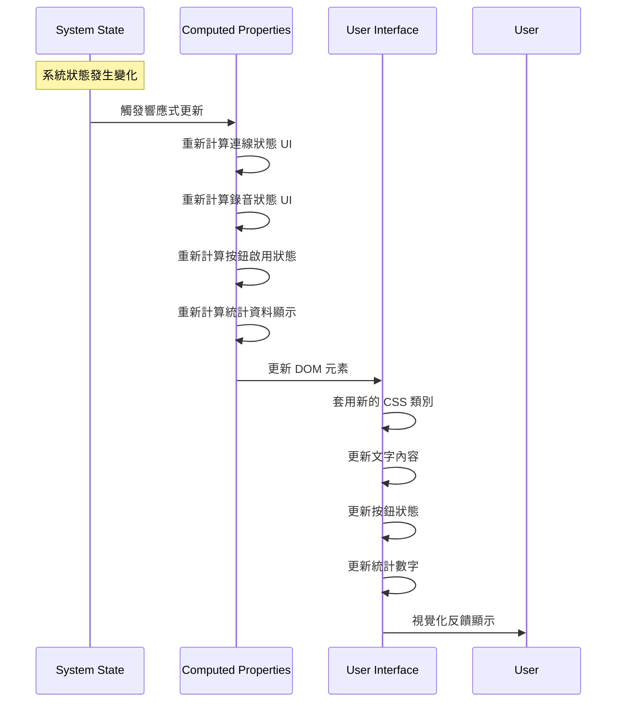
```mermaid
sequenceDiagram
    participant S as System State
    participant C as Computed Properties
    participant UI as User Interface
    participant U as User

    Note over S: 系統狀態發生變化
    S->>C: 觸發響應式更新

    C->>C: 重新計算連線狀態 UI
    C->>C: 重新計算錄音狀態 UI
    C->>C: 重新計算按鈕啟用狀態
    C->>C: 重新計算統計資料顯示

    C->>UI: 更新 DOM 元素
    UI->>UI: 套用新的 CSS 類別
    UI->>UI: 更新文字內容
    UI->>UI: 更新按鈕狀態
    UI->>UI: 更新統計數字

    UI->>U: 視覺化反饋顯示
```

#### 5.6 事件歷史顯示流程

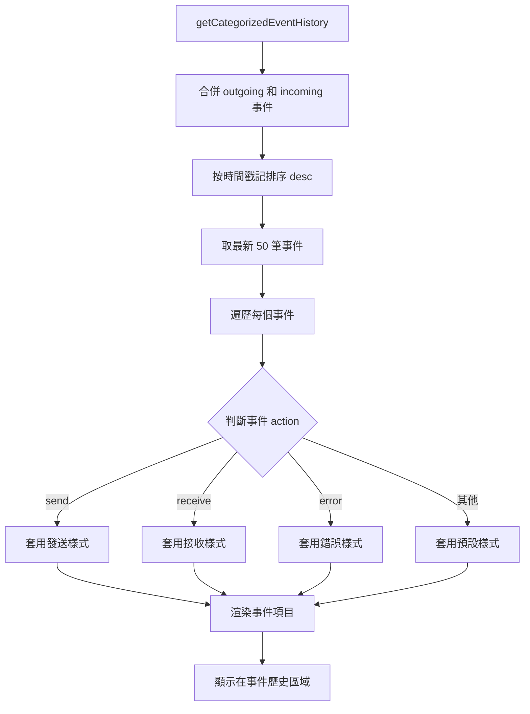
```mermaid
graph TD
    A[getCategorizedEventHistory] --> B[合併 outgoing 和 incoming 事件]
    B --> C[按時間戳記排序 desc]
    C --> D[取最新 50 筆事件]
    D --> E[遍歷每個事件]

    E --> F{判斷事件 action}
    F -->|send| G[套用發送樣式]
    F -->|receive| H[套用接收樣式]
    F -->|error| I[套用錯誤樣式]
    F -->|其他| J[套用預設樣式]

    G --> K[渲染事件項目]
    H --> K
    I --> K
    J --> K

    K --> L[顯示在事件歷史區域]
```

---

## 🔄 6. 檔案下載功能

### 功能描述

將所有已確認的音頻塊合併成完整的音頻檔案並提供下載。

### 📊 相關資料格式

#### 6.1 下載配置

```typescript
interface DownloadConfig {
  filename: string // 檔案名稱格式
  format: 'wav' // 輸出格式 (目前固定為 WAV)
  sampleRate: number // 採樣率 (預設: 44100)
  channels: number // 聲道數 (預設: 2)
}

// 預設配置
const downloadConfig: DownloadConfig = {
  filename: `recording_${new Date().toISOString()}.wav`,
  format: 'wav',
  sampleRate: 44100,
  channels: 2
}
```

#### 6.2 音頻處理結果

```typescript
interface AudioProcessingResult {
  success: boolean // 處理是否成功
  totalChunks: number // 總音頻塊數
  processedChunks: number // 已處理的音頻塊數
  totalDuration: number // 總時長（秒）
  fileSize: number // 檔案大小（位元組）
  errors: string[] // 處理錯誤列表
}
```

### 🔄 功能流程

#### 6.3 檔案下載流程

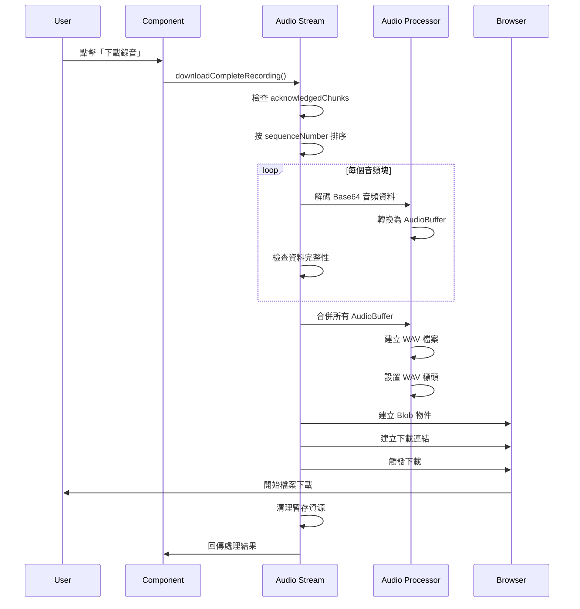
```mermaid
sequenceDiagram
    participant U as User
    participant C as Component
    participant AS as Audio Stream
    participant AP as Audio Processor
    participant B as Browser

    U->>C: 點擊「下載錄音」
    C->>AS: downloadCompleteRecording()

    AS->>AS: 檢查 acknowledgedChunks
    AS->>AS: 按 sequenceNumber 排序

    loop 每個音頻塊
        AS->>AP: 解碼 Base64 音頻資料
        AP->>AP: 轉換為 AudioBuffer
        AS->>AS: 檢查資料完整性
    end

    AS->>AP: 合併所有 AudioBuffer
    AP->>AP: 建立 WAV 檔案
    AP->>AP: 設置 WAV 標頭

    AS->>B: 建立 Blob 物件
    AS->>B: 建立下載連結
    AS->>B: 觸發下載
    B->>U: 開始檔案下載

    AS->>AS: 清理暫存資源
    AS->>C: 回傳處理結果
```

---

## 🔧 7. 系統整合與初始化功能

### 功能描述

負責系統啟動時的初始化設定、各模組間的整合、生命週期管理。

### 📊 相關資料格式

#### 7.1 系統初始化配置

```typescript
interface SystemConfig {
  webSocket: WebSocketConfig // WebSocket 配置
  recording: RecordingConfig // 錄音配置
  audioStream: AudioStreamConfig // 音頻串流配置
  ui: UIConfig // UI 配置
}

interface RecordingConfig {
  chunkInterval: number // 音頻塊間隔 (ms, 預設: 3000)
  audioFormat: string // 音頻格式 (預設: 'webm')
  constraints: MediaStreamConstraints // 媒體約束
}

interface AudioStreamConfig {
  maxRetries: number // 最大重試次數
  retryDelay: number // 重試延遲 (ms)
  queueSize: number // 佇列大小限制
}

interface UIConfig {
  maxEventHistory: number // 最大事件歷史數量
  updateInterval: number // UI 更新間隔 (ms)
  enableAnimations: boolean // 啟用動畫效果
}
```

### 🔄 功能流程

#### 7.2 系統初始化流程

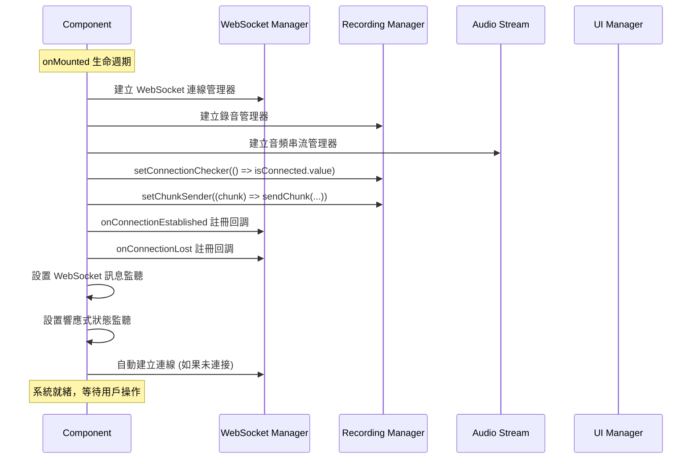
```mermaid
sequenceDiagram
    participant C as Component
    participant WS as WebSocket Manager
    participant R as Recording Manager
    participant AS as Audio Stream
    participant UI as UI Manager

    Note over C: onMounted 生命週期

    C->>WS: 建立 WebSocket 連線管理器
    C->>R: 建立錄音管理器
    C->>AS: 建立音頻串流管理器

    C->>R: setConnectionChecker(() => isConnected.value)
    C->>R: setChunkSender((chunk) => sendChunk(...))

    C->>WS: onConnectionEstablished 註冊回調
    C->>WS: onConnectionLost 註冊回調

    C->>C: 設置 WebSocket 訊息監聽
    C->>C: 設置響應式狀態監聽

    C->>WS: 自動建立連線 (如果未連接)

    Note over C: 系統就緒，等待用戶操作
```

#### 7.3 系統清理流程

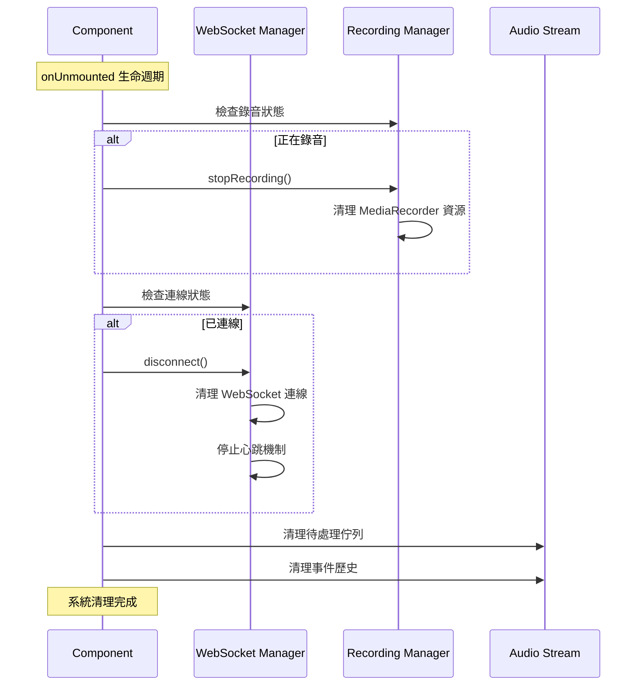
```mermaid
sequenceDiagram
    participant C as Component
    participant WS as WebSocket Manager
    participant R as Recording Manager
    participant AS as Audio Stream

    Note over C: onUnmounted 生命週期

    C->>R: 檢查錄音狀態
    alt 正在錄音
        C->>R: stopRecording()
        R->>R: 清理 MediaRecorder 資源
    end

    C->>WS: 檢查連線狀態
    alt 已連線
        C->>WS: disconnect()
        WS->>WS: 清理 WebSocket 連線
        WS->>WS: 停止心跳機制
    end

    C->>AS: 清理待處理佇列
    C->>AS: 清理事件歷史

    Note over C: 系統清理完成
```

---

## 📈 總結

本文檔按照功能模組詳細說明了 Clean POC 系統的每個功能對應的資料格式和處理流程：

1. **WebSocket 連線管理** - 處理連線建立、心跳監控、斷線重連
2. **音頻錄製** - 控制錄音狀態、生成音頻塊
3. **音頻串流傳輸** - 管理音頻塊傳輸、確認處理、佇列管理
4. **事件歷史追蹤** - 記錄和顯示系統操作事件
5. **UI 狀態管理** - 控制介面狀態、按鈕邏輯、視覺化顯示
6. **檔案下載** - 合併音頻塊並提供下載功能
7. **系統整合** - 負責初始化、模組整合、生命週期管理

每個功能都包含完整的資料格式定義和對應的處理流程，便於理解系統運作機制和進行功能擴展。
